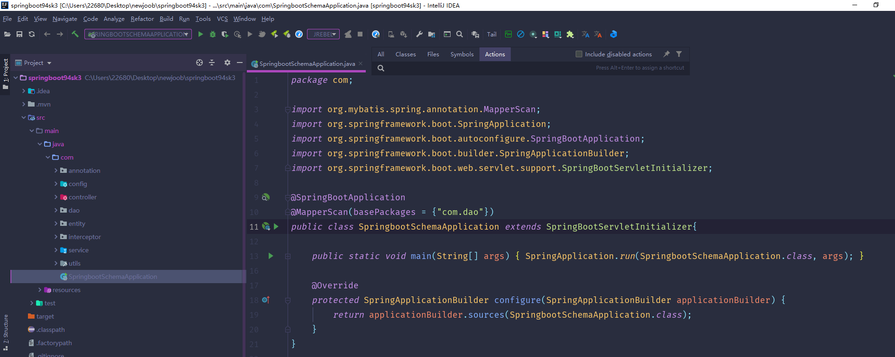
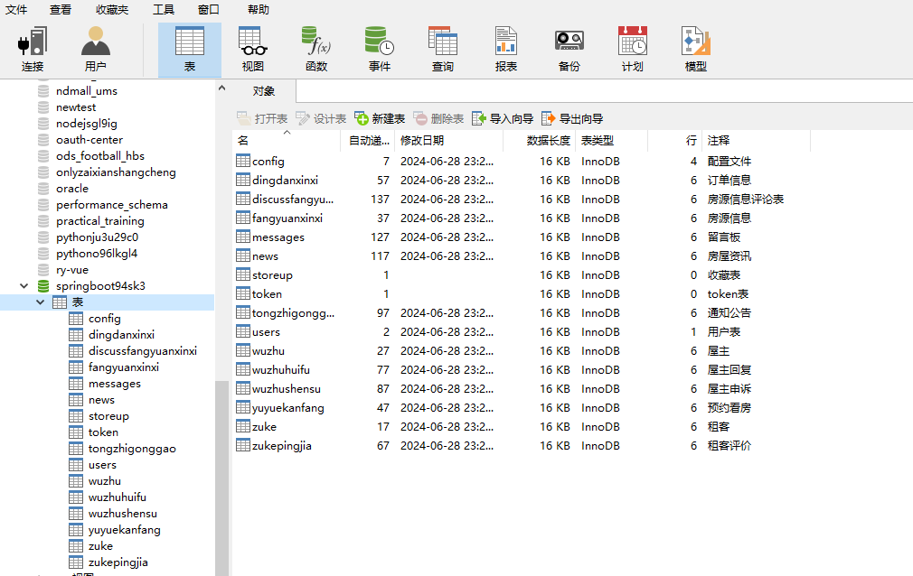
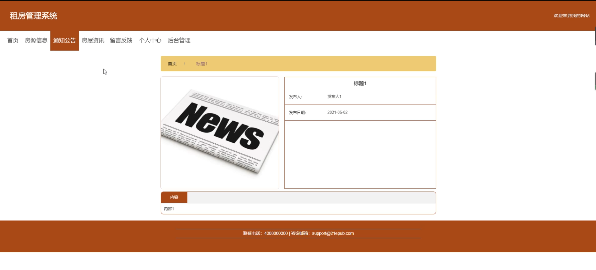
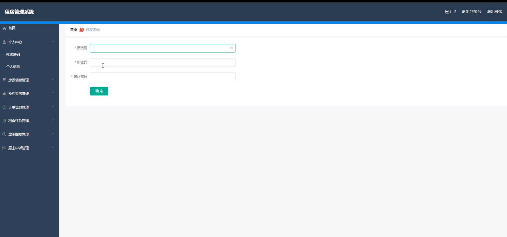
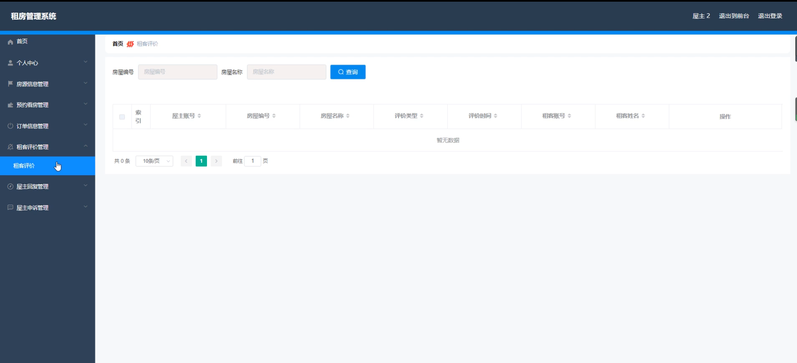
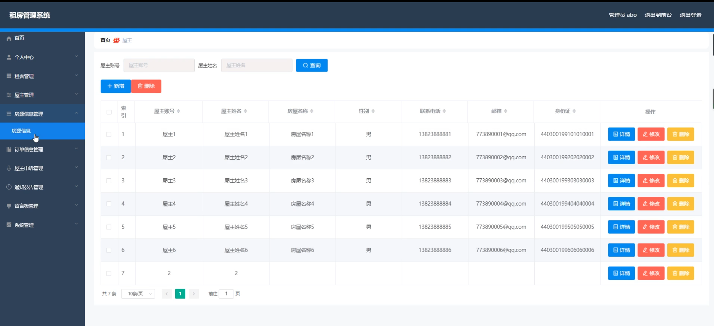
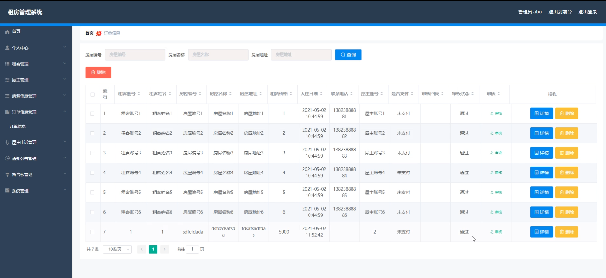
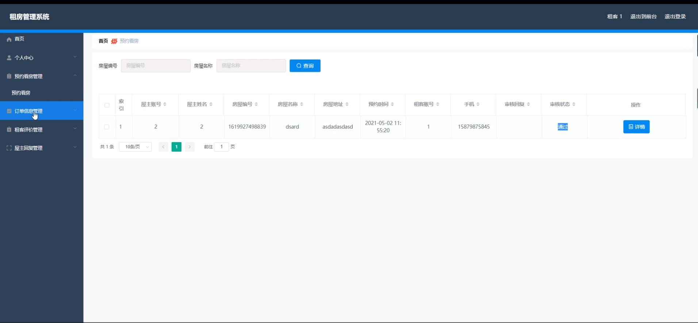

# 基于springboot的租房管理系统

---
### 👉作者QQ ：1556708905 微信：zheng0123Long (支持定制修改、部署调试、定制毕设)

### 👉接网站建设、小程序、H5、APP、各种系统等

---

#### 介绍

我开发了一个基于SpringBoot的租房管理系统，旨在为房屋出租和租赁提供一个高效、便捷和安全的管理平台。该系统拥有管理端、屋主端和租客端三种角色，每个角色都配备了特定的功能模块，以满足不同用户的需求。通过本系统，管理人员可以全面掌控租房信息和用户信息，屋主可以方便地管理房源和与租客的交流，而租客则可以快捷地查找房源、预约看房和提交评价。本系统集成了信息管理、订单处理、通知公告和留言反馈等功能，旨在提升租房管理的效率和用户体验。

#### 技术栈

后端技术栈：Springboot+Mysql+Maven

前端技术栈：Vue+Html+Css+Javascript+ElementUI

开发工具：Idea+Vscode+Navicate

#### 系统功能介绍

管理端功能模块

个人中心：管理员可以管理个人信息，修改密码等。  
租客管理：管理租客的基本信息，包括注册、审核、权限设置等。   
屋主管理：管理屋主的基本信息，包括注册、审核、权限设置等。  
房源信息管理：录入和管理房源的详细信息，包括地址、面积、租金等。  
订单信息管理：管理所有租赁订单的详细信息，跟踪订单状态。  
屋主申诉管理：处理屋主的申诉请求，解决租赁纠纷。  
通知公告管理：发布和管理系统通知和公告。  
留言板管理：查看和管理用户在留言板上的反馈和建议。  
系统管理：系统的整体管理与维护，包括用户权限管理、系统日志查看、数据备份与恢复等。  

屋主端功能模块

房源信息：查看和管理自己的房源信息。  
通知公告：查看系统发布的通知和公告。  
房屋资讯：获取最新的房屋出租相关资讯。  
留言反馈：提交和查看自己的留言反馈。   
个人中心：管理个人信息，修改密码等。  
后台管理：  
房源信息管理：录入和管理自己的房源信息。  
预约看房管理：管理租客的看房预约请求。  
订单信息管理：查看和管理租赁订单信息。  
租客评价管理：查看租客对自己的评价。  
屋主回复管理：回复租客的评价和留言。  
屋主申诉管理：提交和管理自己的申诉请求。  

租客端功能模块

房源信息：浏览和查询房源的详细信息。  
通知公告：查看系统发布的通知和公告。  
房屋资讯：获取最新的租房相关资讯。  
留言反馈：提交和查看自己的留言反馈。    
个人中心：管理个人信息，修改密码等。  
后台管理：  
预约看房管理：提交和管理看房预约请求。  
订单信息管理：查看和管理自己的租赁订单信息。  
租客评价管理：提交对房屋和屋主的评价。  
屋主回复管理：查看屋主对自己评价的回复。  

#### 系统作用

提升租房管理效率：管理端通过系统可以高效地管理租客、屋主和房源信息，减少手工操作，提高工作效率。  
便捷的房源管理：屋主端可以方便地录入和更新房源信息，管理租客预约，跟踪租赁订单，提升管理便利性。  
全面的租房信息：租客端可以快速浏览和查询房源信息，预约看房，查看订单和提交评价，提高租房体验。  
优化的沟通交流：系统提供留言板和评价回复功能，促进屋主和租客之间的沟通交流，解决租赁过程中出现的问题。  
及时的信息发布：通过通知公告模块，系统可以及时向所有用户发布重要信息和公告，确保信息的快速传达。  
系统的安全管理：系统管理模块确保了系统的安全运行和数据的有效管理，提供数据备份与恢复功能，保障数据安全。  

#### 系统功能截图

代码结构

数据库表

登录

前台页面首页

房源信息

通知公告

留言反馈

个人中心

屋主端后台管理

租客评价

屋主信息管理

订单信息管理

预约看房管理

#### 总结

基于SpringBoot的租房管理系统通过集成多角色、多功能模块，实现了租房信息和用户信息的高效管理。系统为管理端、屋主端和租客端提供了全面的功能支持，提升了租房管理的效率和用户的使用体验。管理员、屋主和租客可以通过各自的角色和功能模块，进行信息管理、订单处理、沟通交流等操作，使得租房过程更加便捷和高效。系统的全面性和互动性使其能够满足不同用户的需求，提升了租房管理的整体水平。未来可以根据用户反馈和需求，继续优化和扩展系统功能，提供更完善的服务。

#### 使用说明

创建数据库，执行数据库脚本 修改jdbc数据库连接参数 下载安装maven依赖jar 启动idea中的springboot项目

后台地址：http://localhost:8080/springboot94sk3/admin/dist/index.html

管理员  abo 密码 abo

前台地址：http://localhost:8080/springboot94sk3/front/index.html

